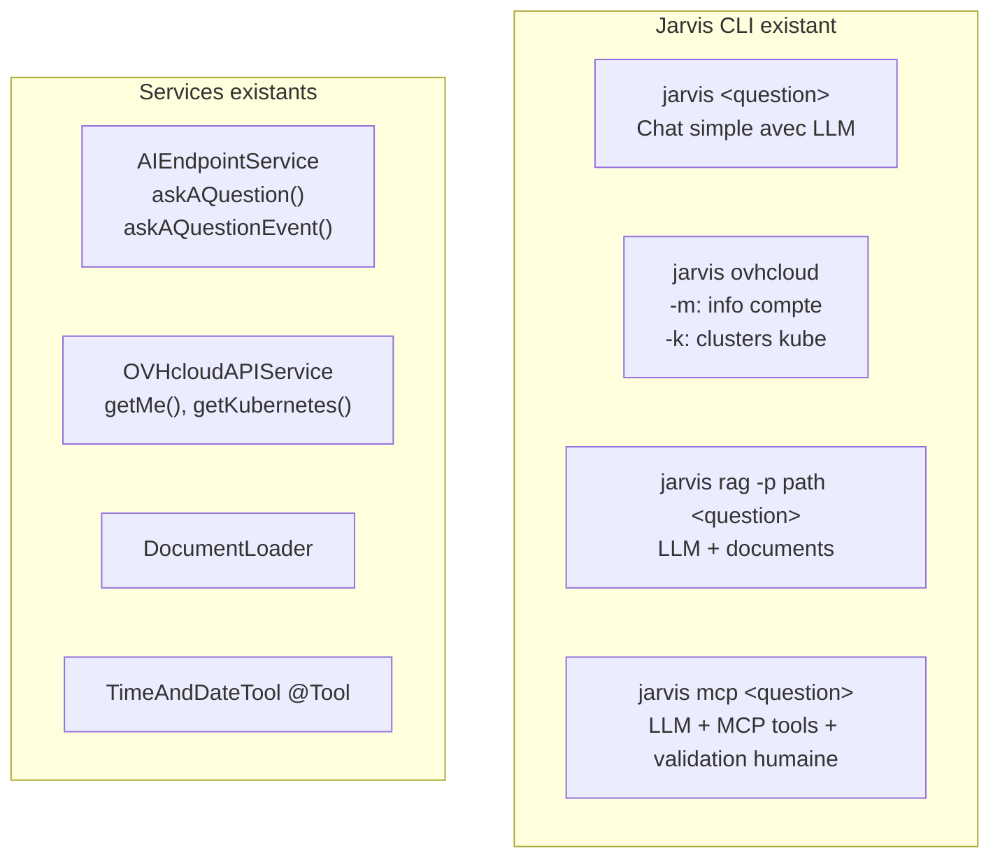
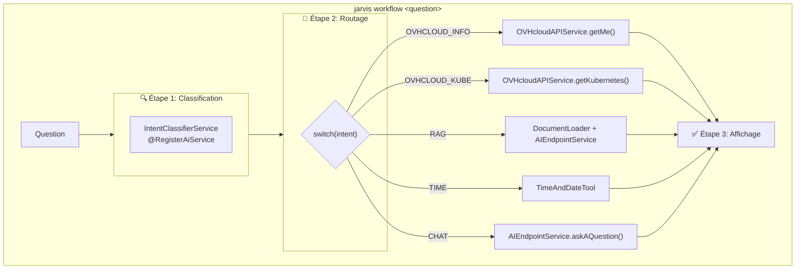
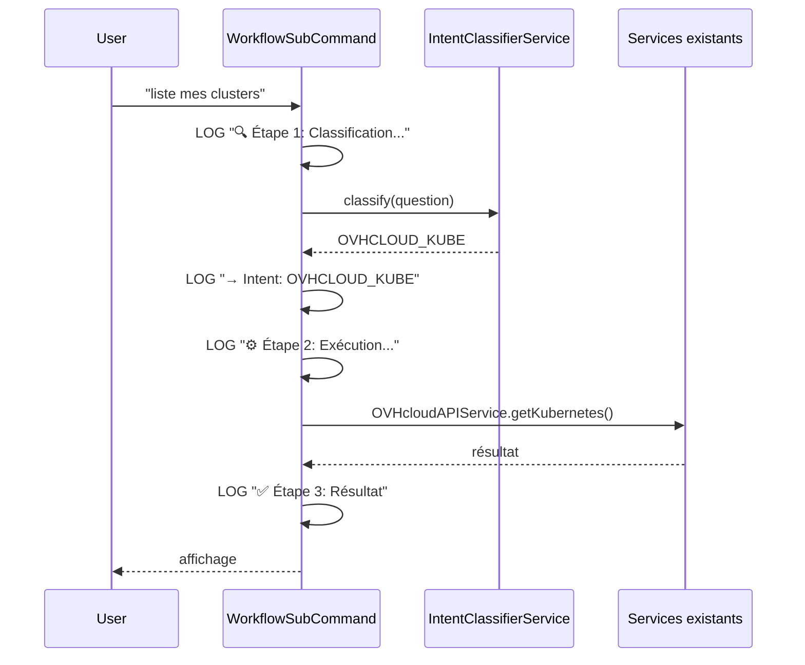
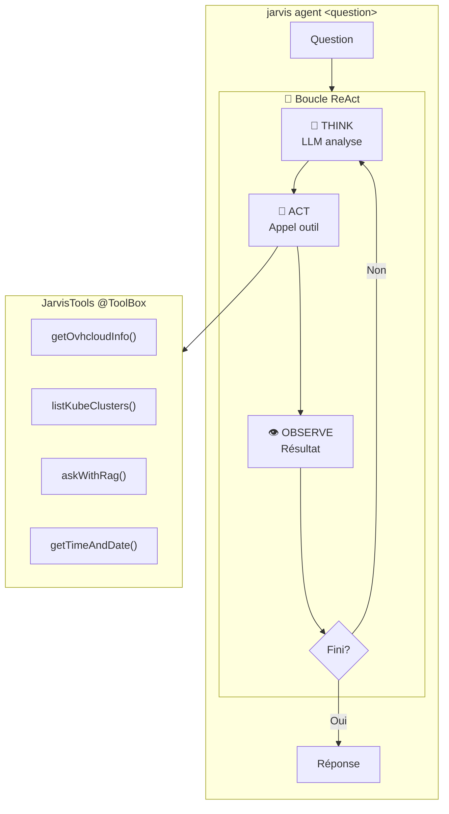
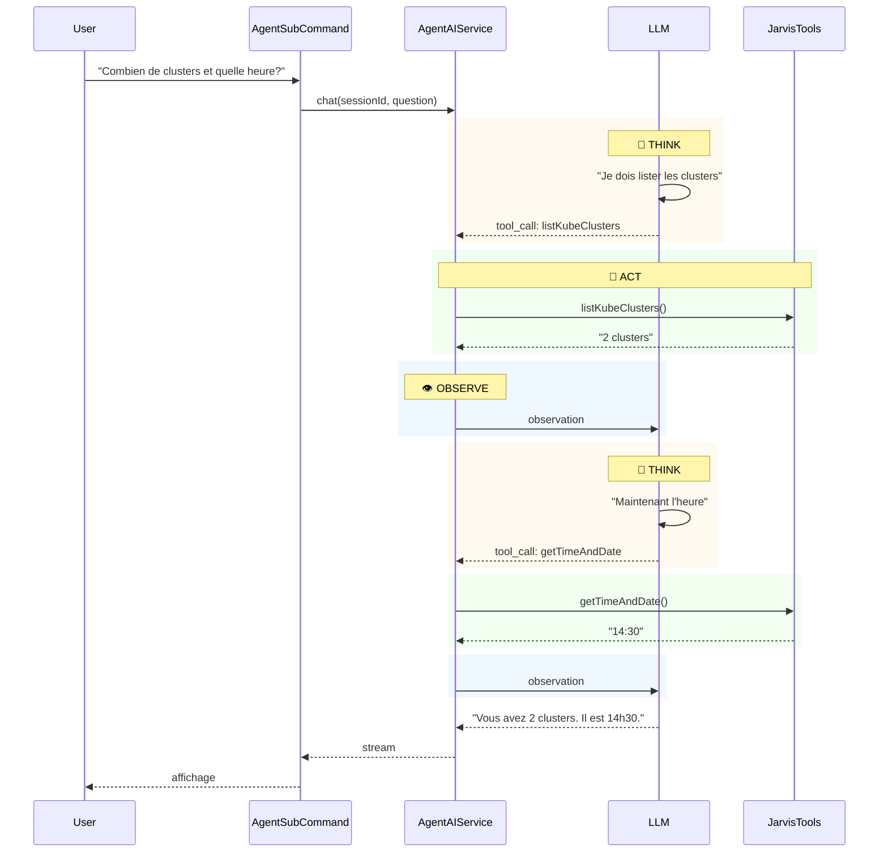

# Plan : Conception Agentique pour Jarvis CLI

**TL;DR** : À partir des 4 sous-commandes existantes (`jarvis`, `ovhcloud`, `rag`, `mcp`), créer 2 nouvelles sous-commandes pour illustrer les approches **Workflow** (classification → routage → exécution) et **ReAct** (boucle autonome Think → Act → Observe).

---

## État actuel de l'application

**Composants clés réutilisables :**
- `AIEndpointService.askAQuestionEvent()` → retourne `Multi<ChatEvent>` avec `BeforeToolExecutionEvent`
- `OVHcloudAPIService` → appels REST OVHcloud
- `DocumentLoader` → ingestion documents pour RAG
- `TimeAndDateTool` → outil `@Tool` existant
- `@McpToolBox` → outils MCP déjà configurés

---

## Approche 1 : Workflow Agentique

### Concept
Le **code orchestre** les étapes. Le LLM sert uniquement à **classifier l'intention**.

### Architecture

### Fichiers à créer

| Fichier | Description |
|---------|-------------|
| `IntentClassifierService.java` | Interface `@RegisterAiService` qui retourne un `enum Intent` |
| `WorkflowSubCommand.java` | Sous-commande avec les 3 étapes visibles dans les logs |

### Séquence

---

## Approche 2 : Agent ReAct

### Concept
Le **LLM décide** des actions via une boucle autonome : **Think → Act → Observe → Repeat**.

### Architecture

### Fichiers à créer

| Fichier | Description |
|---------|-------------|
| `JarvisTools.java` | Classe avec méthodes `@Tool` encapsulant les services existants |
| `AgentAIService.java` | Interface `@RegisterAiService` + `@ToolBox` + `@McpToolBox` |
| `AgentSubCommand.java` | Sous-commande utilisant `ChatEvent` pour afficher la boucle |
| `AgentChatMemoryProvider.java` | Provider pour `@MemoryId` (mémoire conversation) |

### Séquence

---

## Comparaison

| Aspect | Workflow | ReAct |
|--------|----------|-------|
| **Contrôle** | Code | LLM |
| **LLM sert à** | Classifier | Décider + Agir |
| **Étapes** | Fixes, visibles | Dynamiques |
| **Flexibilité** | Cas prévus | Gère l'imprévu |
| **Tokens** | ~1 appel | N appels (boucle) |

---

## Steps

1. **Créer** `IntentClassifierService.java` - enum Intent + méthode classify()
2. **Créer** `WorkflowSubCommand.java` - 3 étapes avec logs
3. **Créer** `JarvisTools.java` - @Tool wrappant les services existants
4. **Créer** `AgentAIService.java` - @RegisterAiService + @ToolBox + @McpToolBox
5. **Créer** `AgentSubCommand.java` - utilisant ChatEvent pour verbose
6. **Créer** `AgentChatMemoryProvider.java` - pour @MemoryId
7. **Modifier** `JarvisCommand.java` - ajouter les 2 nouvelles subcommands
8. **Modifier** `TimeAndDateTool.java` - rendre getTimeAndDate() public

---

## Further Considerations

1. **Validation humaine pour ReAct ?** Comme dans `McpSubCommand`, ajouter une option pour valider chaque outil avant exécution.
2. **Limite d'itérations ReAct ?** Ajouter un paramètre `--max-iterations` pour éviter les boucles infinies.
3. **Mode verbose par défaut ?** Pour la démo, afficher systématiquement Think/Act/Observe ou seulement avec `-v`.

